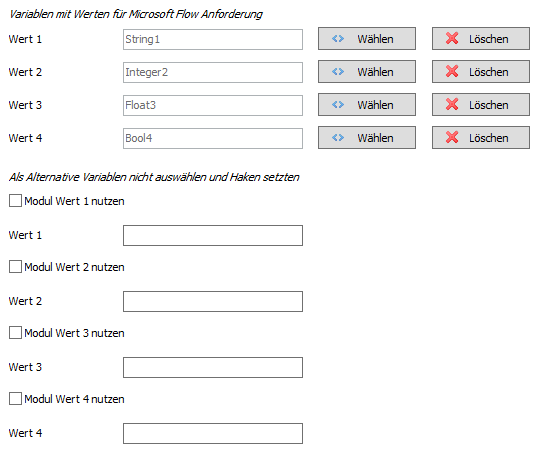
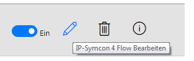
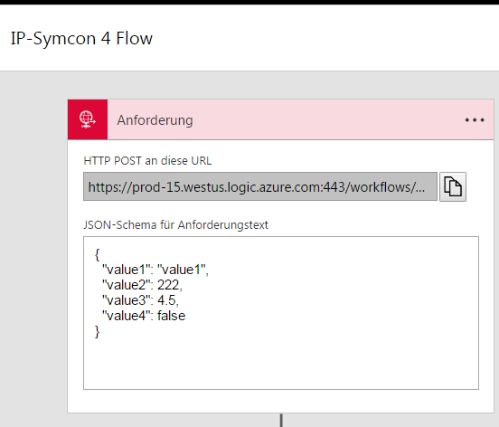
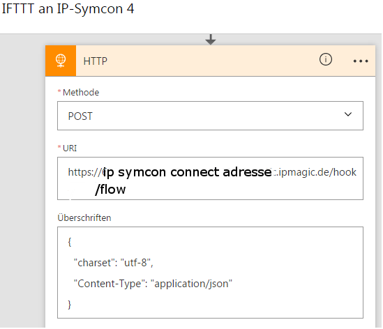
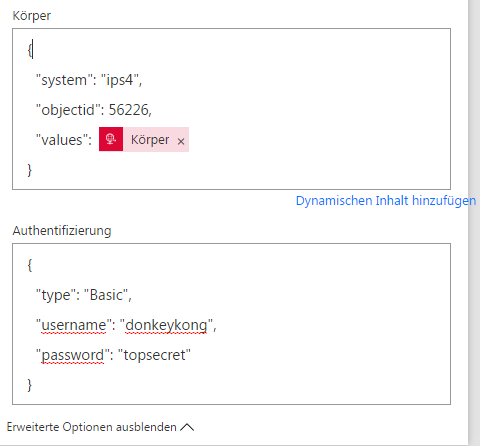

# IPSymconFlow
===

Modul für IP-Symcon ab Version 4.1 ermöglicht die Kommunikation mit dem Dienst Microsoft Flow.

## Dokumentation

**Inhaltsverzeichnis**

1. [Funktionsumfang](#1-funktionsumfang)  
2. [Voraussetzungen](#2-voraussetzungen)  
3. [Installation](#3-installation)  
4. [Funktionsreferenz](#4-funktionsreferenz)
5. [Konfiguration](#5-konfiguration)  
6. [Anhang](#6-anhang) 

## 1. Funktionsumfang

Der Internet Dienst Microsoft Flow bietet die Möglichkeit verschiedene Internetdienste miteinander zu verknüpfen
und so Arbeitsabläufe zu erstellen, genannt Flows. Es lassen sich auch mehrere Dienste in Reihe verknüpfen.
Zwischen einzelnen Diensten können auch Bedingungen geschaltet werden oder Flows zeitverzögert ausgeführt werden.
Da es sich um einen Microsoft Dienst handelt lassen sich insbesondere Microsoft Anwendungen wie Azure, Excel, Project,
Sharepoint, Outlook, OneDrive, SQL Server, Microsoft Translator aber auch viele andere Dienste zu einem Workflow verknüpfen.
Das Modul bindet Flow an IP-Symcon an. Es können Flows in Microsoft Flow von IP-Symcon getriggert werden als auch
Daten aus einem Flow in Variablen in IP-Symcon geschrieben werden. Es sind in IP-Symcon bis zu 15 Variablen
definierbar die einen Flow triggern bzw. aus Microsoft Flow beschrieben werden können. Auf dieser Weise lassen sich
Kanäle von Flow mit IP-Symcon 4 verknüpfen.

[Microsoft Flow](https://flow.microsoft.com "Microsoft Flow")

[Microsoft Flow Getting Started](https://flow.microsoft.com/en-us/documentation/getting-started/ "Microsoft Flow Getting Started")

## 2. Voraussetzungen

 - IPS 4.1
 - IP-Symcon Connect
 - Account bei [Microsoft Flow](https://flow.microsoft.com "Microsoft Flow")

## 3. Installation

### a. Laden des Moduls

 Wir wechseln zu IP-Symcon (Ver. 4.1) und fügen unter Kerninstanzen über _*Modules*_ -> Hinzufügen das Modul hinzu mit der URL
```
https://github.com/Wolbolar/IPSymconMicrosoftFlow
```	

### b. Einrichtung in IPS

In IP-Symcon wird von jeden Flow den wir triggern wollen eine seperate Instanz angelegt. Der Flow IO und Flow Splitter wird
automatisch mit angelegt. Um die Instanz zu erstellen wechseln wir in die Kategorie, unter der wir die Instanz platzieren wollen
und erstellen mit *CTRL+1* eine neue Instanz.


Über _**Flow**_ finden wir die Instanz und mit weiter und Ok wird diese angelegt.

##### Auswahl der Kommunikation und Anzahl der Variablen
Es gibt die Möglichkeit aus IP-Symcon herraus einen Flow zu triggern als auch die Möglichkeit Daten von einem Flow an IP-Symcon zu schicken.
Jede IP-Symcon Flow Instanz steht für ein Event das in Micrrosoft Flow auftritt es können beliebig viele Instanzen angelegt werden.
Nach dem Öffen der Instanz erscheint zunächst eine Abfrage ob die aktuelle Instanz nur zum *Senden*, *Empfangen* oder zum *Senden/Empfangen* dienen soll.


Nachdem die passende Auswahl getroffen wurde bestätigen wir mit _Übernehmen_ anschließend **schließen wir die Instanz** und öffnen diese dann erneut.

Nun haben wir je nach vorheriger Auswahl weitere Optionen. 


Da es unzählige Flows und damit unzählige Möglichkeiten gibt was von Microsoft Flow an IP-Symcon geschickt werden kann, je nachdem welchen Flow
man verwendet, muss pro angelegter Instanz vom Nutzer festgelegt werden vielviele Variablen von Flow erwartet werden. Dabei ist dabei darauf zu
achten das der gewählte Variablentyp dem zu erwartenden Wert aus Flow entspricht, ansonsten werden die Daten nicht abgelegt. Alternativ können auch
keine existierenden Variablen angegeben werden sondern ein Haken gesetzt werden im Modul, dann legt das Modul beim ersten Eintreffen von Daten in der
Instanz in IP-Symcon die Variablen passend zum Variablentyp der Daten an. Wichtig ist nur das die Anzahl der Variablen mit der Anzahl der von Flow
versendeten Daten übereinstimmt. Die maximale Anzahl an Variablen, die das Modul zur Zeit verwaltet liegt bei 15. Sollte es dennoch Flows geben die
mehr Variablen benötigen kann dies zukünftig aber auch noch erhöht werden. 

Nachdem die passende Anzahl der Variablen selektiert wurde bestätigen wir mit _Übernehmen_ anschließend **schließen wir die Instanz** und öffnen diese dann erneut.

##### Festlegen der Variablen oder Konstanten

###### Konfiguration Anforderung (Senden an Flow)

Flow Modul Anforderung 



Im Bereich Senden an Flow haben wir die Auswahl ob wir eine existierende Variable benutzen wollen. Dann wählen wir diese bei _Variablen mit Werten für Microsoft Flow Anforderung_ aus.
Wenn wir eine Konstante einem Wert den wir an Flow schicken wollen zuweisen wollen lassen wir das Feld zum Variablen auswählen leer und kreuzen _Modul Wert nutzen_ an und tragen
dann den Wert in das dazugehörige Feld ein.

###### Konfiguration HTTP (Empfangen von Flow)

Flow Modul HTTP 


Im Bereich Empfang von Flow haben wir die Auswahl ob wir eine existierende Variable benutzen wollen. Dann selektieren wir die passende Variable im Auswahlfeld. Wenn noch keine Variable
haben könne wir auch _Variable für Wert vom Modul anlegen_ auswählen. Das Modul legt dann passend zum den ankommenden Daten von Flow eine Vraiable des entsprechnden Variablentyps an.

###### URL Feld beim Versenden
Um Daten an Microsoft Flow senden zu können müssen wir im Modul einen URL eintragen, um diese zu erhalten müssen wir zunächst mit der Konfiguration einer Anforderung in Microsoft Flow
fortfahren.

### c. Konfiguration von Microsoft Flow

Wir melden uns bei [Microsoft Flow](https://flow.microsoft.com "Microsoft Flow") an und wechslen in die Ansicht _Meine Flows_.


Abhänig davon ab wir Daten an  Flow schicken wollen oder von Flow Daten erhalten wollen gehen wir nun unterschiedlich vor.

#### Anlegen einer Anforderung in Microsoft Flow
Wenn wir Daten an Flow verschicken wollen müssen wir nun in Flow eine Anforderung als Trigger für einen Flow erstellen. Nachdem wir im Modul ja festgelegt haben wieviele Variablen bzw. Werte
wir benötigen könne wir nun die Anfoderung erstellen.

Unter Meine Flows wählen wir _**Ohne Vorlage neu erstellen**_

Als Trigger wählen wir Anforderung


Es öffnet sich ein Fenster mit der Anforderung


Das Feld _**HTTP POST an diese URL**_ ist noch leer. Die URL wird erst angezeigt wenn wir den Flow fertig erstellt haben und dann den Flow erneut zum bearbeiten wieder öffnen.
Im nächsten Schritt fügen wir eine Bedingung oder Aktion hinzu. Wir können nun mehrere Aktionen und Bedingungen in einer Reihe verknüpfen. Ein Flow muss mindestens aus einem
Trigger und einer Aktion bestehen.


Hier fahren wir jetzt mit den weiteren Schritten bei der Erstellung des Flows fort und erstellen diesen am Schluss.


Dann können wir in der Liste der eigenen Flows den soeben erstellten Flow zum Bearbeiten über _Flow bearbeiten_ öffnen.



Wenn wir nun den Flow erneut öffnen und auf die Anforderung klicken steht nun hier eine URL, diese kopieren wir in die Zwischenablage und fügen diese dann in das Feld _**HTTP POST URL**_ im Modul ein.
Das JSON Schema ergänzen wir entsprechend der Anzahl an Werten die wir vom Modul verschicken.

Anforderung Flow  



Wenn nun soweit alles eingetragen wurde und die URL im Modul übernommen wurde können wir nun aus IP Symcon den soeben erstellten Flow Triggern.

#### Einrichtung eines Flows zum Senden an IP-Symcon

Wenn wir über einen Flow Daten an IP-Symcon verschicken wollen erstellen wir zunächst den Flow wie wir ihn benötigen und schließen den Flow dann mit einer Aktion _HTTP_ ab.


Flow HTTP 

 

 


Das Modul in IP Symcon erwartet die Daten wie folgt:

| Eigenschaft           | Wert                                                                                        |
| :-------------------: | :-----------------------------------------------------------------------------------------: |
| _**URI**_             | IP-Symcon Connect Adresse/hook/flow                                                         |
|_**Methode**_          | POST                                                                                        |
|_**Header**_           | {"charset":"utf-8","Content-Type":"application/json"}                                       |                                                                                          |
|_**Body**_             | {"system":"ips4","objectid":22222,"values":\[payload\]}	                                  |
|_**Authentifizierung**_| {"type":"Basic","username":\[username\],"password":\[password\]}	                          |
|\[_username_\]         | Username im IFTTT IO wird auch in der Testumgebung der Instanz angezeigt                    |
|\[_password_\]         | Passwort im IFTTT IO wird auch in der Testumgebung der Instanz angezeigt                    |
|_objectid_             | ObjektID der IFTTT Instanz die die Daten entgegen nehmen soll                               |
|_values_ (\[payload\]) |{"value1":"value1string","value2":value2boolean,"value3":value3integer,"value4":value4float} |

Die Values werden innerhalb der Form als JSON übergeben. Keys sind immer in "" zu setzen ebenso String Variablen.
Integer, Float und Boolean sind keine "" um die Variable zu setzen. In dem Beispiel oben wenn es sich um eine Email
handeln würde wären also alle Variablen vom Typ String und werden in "" gesetzt.
		
Jetzt sollte wenn das Recipe triggert ein Web Request an IP-Symcon über Microsoft Flow geschickt werden. Der Inhalt wird in die gewählten Variablen der IFTTT Instanz
abgelegt. Sollten die Auswahl getroffen worden sein das das Modul die Variablen anlegt, so werden diese mit dem ersten Eintreffen von Daten in IP-Symcon
automatisch entsprechend dem Variablentyp der Daten in IP-Symcon angelegt.

Auf die Variablen können wir dann in IP-Symcon ein Ereigniss legen das z.B. bei einem bestimmten Wert oder einer Variablenänderung oder Variablenaktualisierung
weitere Dinge in IP-Symcon ausführt. Vielleicht lässt sich auf diese Weise ja noch das ein oder andere in IP-Symcon einbinden für das es derzeit noch keine Skripte
oder Module gibt.

## 4. Funktionsreferenz

### Flow
Im der Flow Instanz ist einzustellen ob die Instanz nur zum Senden, Empfangen oder Senden/Empfangen
benutzt werden soll. So können für jede Anforderung die in Microsoft Flow ausgelöst werden soll Variablen
und Konstanten definiert werden, die beim Auslösen des Events in IP-Symcon an Microsoft Flow gesendet
werden.
 
Sendet einen Trigger an den hinterlegten Webhook von Microsoft Flow mit den im Modul hinterlegten Variablen.
```php
Flow_TriggerFlow(integer $InstanceID)
```   
Parameter _$InstanceID_ __*ObjektID*__ der Flow Instanz
  
Sendet einen Trigger an Microsoft Flow an eine Flow URL und Werten.
```php
Flow_SendFlowTrigger(integer $InstanceID, string $flowwebhook, string $values) 
```    
Parameter _$InstanceID_    _*ObjektID*_ der Zapier Instanz

Parameter _$flowwebhook_   URL des Flow Webhooks

Parameter _$values_ 	   Werte als JSON 
  
Für den Empfang von Daten von Flow können Variablen im Modul ausgewählt werden. Dabei ist darauf
zu achten das der Variablentyp dem von Flow versendeten Daten entspricht sonst werden keine Daten
abgelegt. Alternativ kann man auch im Modul angeben dass das Modul die Variablen anlegen soll. Die
Variablen werden dann beim ersten Empfangen von Daten von Zapier automatisch entsprechend dem Variablentyp
in IP-Symcon angelegt.  

### Flow IO
Der Webhook in IP-Symcon ist durch einen Benutzernamen und Passwort abgesichert. Im Flow IO
kann das vorgegebene Passwort bei Bedarf geändert werden. Der aktuelle Benutzername und das
aktuelle Passwort wird in der Testumgebung der Flowinstanz angezeigt zur Konfigurationshilfe. 
 

## 5. Konfiguration:

### Flow IO:

| Eigenschaft | Typ     | Standardwert | Funktion                                                        |
| :---------: | :-----: | :----------: | :-------------------------------------------------------------: |
| username    | string  | 		       | username für Microsoft Flow zur Authentifizierung bei IP-Symcon |
| password    | string  |              | password für Microsoft Flow zur Authentifizierung bei IP-Symcon |

username und password sind vorab eingestellt können aber individuell angepasst werden.

### Flow:  

| Eigenschaft      | Typ     | Standardwert| Funktion                                                    |
| :--------------: | :-----: | :---------: | :---------------------------------------------------------: |
| zapierwebhook    | string  |             | URL des Flow Webhooks an den der Trigger geschickt wird     |
| selection        | integer |      0      | Konfigurationsauswahl 1 Senden, 2 Empfang, 3 Senden/Empfang |
| countrequestvars | integer |      0      | Anzahl der Variablen die von Flow beschrieben werden        |
| countsendvars    | integer |      0      | Anzahl der Variablen die an Flow gesendet werden sollen     |
| varvalue 1-15    | integer |      0      | ObjektID einer Variable                                     |
| modulinput 1-15  | integer |      0      | Aktivieren für Modulkonstante statt Variable                |
| value 1-15       | string  |      0      | Konstante kann als Wert im Modul hinterlegt werden          |
| requestvarvalue  | integer |    false    | ObjektID einer Variable                                     |
| modulrequest     | string  |    false    | statt eigener Variable wird eine Variable vom Modul angelegt|


## 6. Anhang

###  a. GUIDs und Datenaustausch:

#### Flow IO:

GUID: `{09A63600-4313-4CE9-8875-8F64A44C5D5E}` 


#### Flow:

GUID: `{A34F3D85-8A77-4557-918B-7D0A13EC8089}` 


